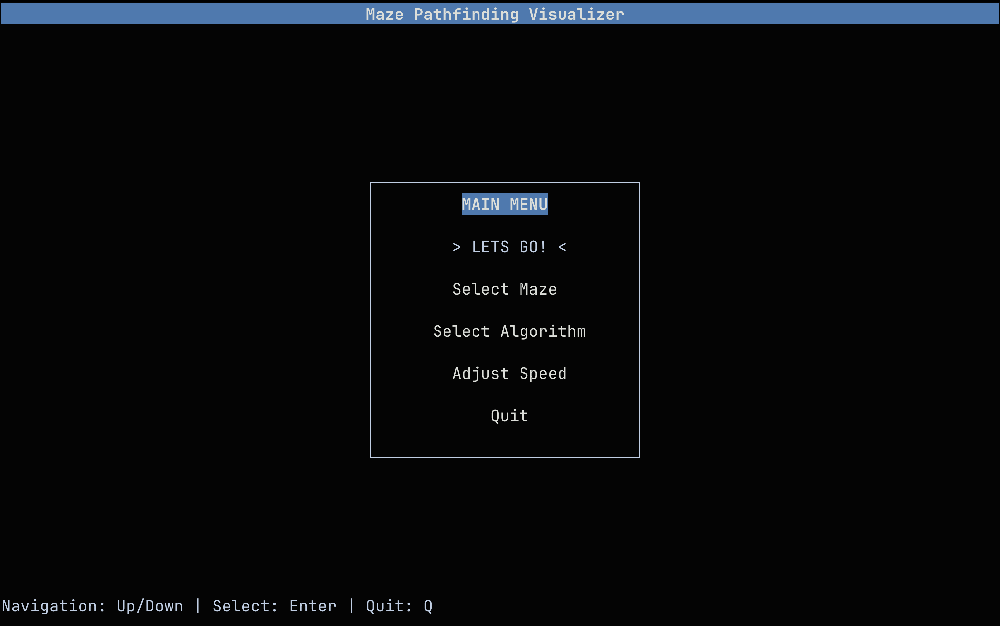

# Maze Pathfinding Visualizer

A terminal-based maze solving application that visualizes different pathfinding algorithms in real-time. Watch as algorithms explore mazes step-by-step, comparing their efficiency and pathfinding strategies.



## Features

- **5 Pathfinding Algorithms**: BFS, DFS, A*, Greedy Search, and Random Search
- **Real-time Visualization**: Watch algorithms explore mazes step-by-step
- **Performance Metrics**: Track nodes explored and path length
- **Multiple Datasets**: 14 different maze configurations
- **Interactive UI**: Navigate with arrow keys and Enter

## Algorithms

| Algorithm | Strategy | Best For |
|-----------|----------|----------|
| **Breadth-First Search (BFS)** | Explores all neighbors before moving deeper | Guaranteed shortest path |
| **Depth-First Search (DFS)** | Explores one path completely before backtracking | Memory efficient |
| **A\* Search** | Uses heuristic to guide search toward goal | Optimal path with good performance |
| **Greedy Search** | Always moves toward goal | Fast but not always optimal |
| **Random Search** | Randomly explores maze | Demonstrates inefficient search |

## Demo Videos

### Maze 5 - Small Maze Comparison

**BFS on Maze 5** - Watch BFS find the shortest path


**A\* on Maze 5** - See A\* efficiently navigate to goal  


### Maze 9 - Complex Maze Comparison

**BFS on Maze 9** - BFS exploring a complex maze


**A\* on Maze 9** - A\* tackling the same complex maze


## Screenshots

### Algorithm Selection


### Dataset Browser


### Algorithm Execution


### Speed Config


## Installation

### Prerequisites
- C++11 compatible compiler (GCC 4.8+ or Clang 3.3+)
- ncurses library

### macOS
```bash
# Install ncurses
brew install ncurses

# Build and run
make
./maze_visualizer
```

### Linux
```bash
# Install ncurses (Ubuntu/Debian)
sudo apt-get install libncurses5-dev

# Build and run
make
./maze_visualizer
```

## Usage

1. **Start the application**: `./maze_visualizer`
2. **Select algorithm**: Use arrow keys to choose from BFS, DFS, A*, Greedy, or Random (BFS is default)
3. **Choose dataset**: Pick from 14 different maze configurations (5 is defualt)
4. **Set speed**: Adjust visualization speed (1-10)
5. **Run**: Press Enter to start the algorithm
6. **Watch**: Observe the algorithm exploring the maze in real-time
7. **Results**: View performance metrics and path statistics

### Controls
- **Arrow Keys**: Navigate menus / Change speed
- **Enter**: Select/confirm
- **Q**: Quit application
- **R**: Restart algorithm
- **P**: Pause algorithm

## Project Structure

```
task1/
├── algos/           # Algorithm implementations
├── dataset/         # 14 maze datasets
├── demos/           # Screenshots and videos
├── include/         # Header files
├── src/             # Main application
├── ui/              # User interface components
└── utils/           # Utility functions
```

## Building

```bash
# Standard build
make

# Clean build files
make clean

# Build and run
make run
```

## Performance Comparison

Different algorithms excel in different scenarios:

- **BFS**: Always finds shortest path, but may explore many nodes
- **DFS**: Memory efficient, but path may not be optimal
- **A\***: Best balance of optimality and efficiency
- **Greedy**: Fast but can get stuck in local optima
- **Random**: Demonstrates why guided search is important
